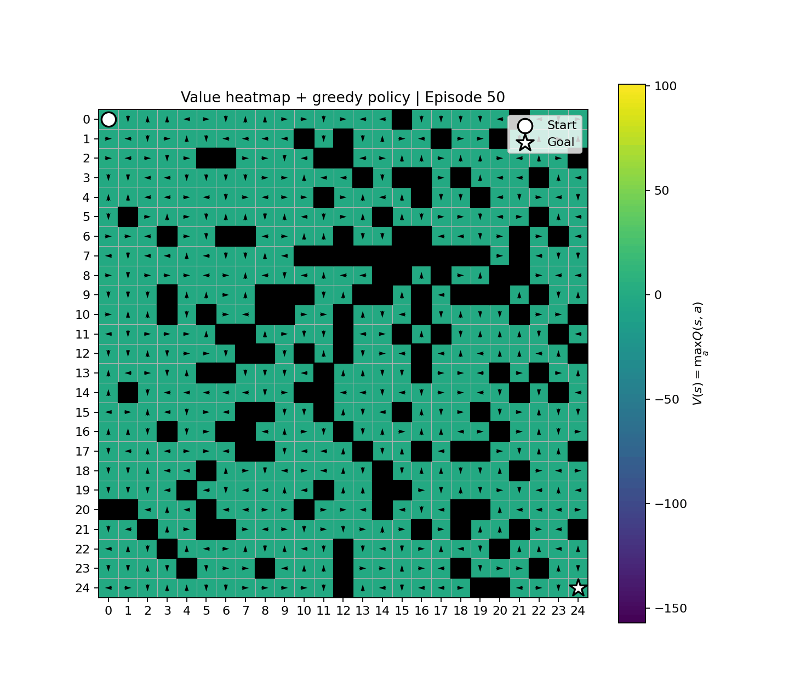

# RL_cpp

A C++ project for studying **tabular Reinforcement Learning**, currently focused on **GridWorld** and **Monte Carlo Off-Policy Control**.

The project keeps the **training core in C++** and uses external tools, mainly Python, for plotting, visualization, and post-analysis.

---

## Current Focus

- Tabular Reinforcement Learning
- GridWorld environments
- Monte Carlo Off-Policy Control
- CSV training logs
- Checkpoint/resume support
- Periodic snapshots for visualization
- Offline export for 2D plots and animations

---

## Requirements

### C++ build dependencies

On Ubuntu:

```bash
sudo apt update
sudo apt install build-essential cmake ninja-build nlohmann-json3-dev
```

The project uses:

- C++17
- CMake
- Ninja
- `nlohmann/json`

### Python visualization dependencies

For plotting and animation:

```bash
pip3 install numpy pandas matplotlib pillow
```

For MP4 animation output:

```bash
sudo apt install ffmpeg
```

If you use a virtual environment, activate it before installing the Python packages.

---

## Quick Start

Build the project:

```bash
./scripts/build.sh
```

Before training, check the main experiment options in:

```text
config.json
```

The most important fields are:

```json
{
  "run_name": "run_001",
  "resume": false
}
```

`run_name` defines where the results will be saved:

```text
runs/<run_name>/
```

`resume` controls whether training should continue from:

```text
runs/<run_name>/checkpoints/latest/
```

Basic meaning:

```text
resume = false
    Start a new run.

resume = true
    Continue from the latest checkpoint if it exists.
    If no checkpoint exists, start a new run.
```

The same `config.json` file also controls the GridWorld environment, the Monte Carlo agent, the number of episodes, checkpointing, and snapshot generation.

For more details, see:

- [Configuration](docs/configuration.md)
- [Training](docs/training.md)

Start training:

```bash
./scripts/train.sh
```

---

## Configuration Overview

The main experiment file is:

```text
config.json
```

It contains three main blocks:

```json
{
  "environment": {},
  "agent": {},
  "training": {}
}
```

### `environment`

Defines the GridWorld:

- grid size
- obstacle density
- obstacle generation mode
- start and goal states
- rewards
- maximum episode length
- solvability checks

### `agent`

Defines the Monte Carlo Off-Policy agent:

- discount factor
- epsilon for the behavior policy
- first-visit or every-visit update mode
- random seed

### `training`

Defines how the experiment runs:

- episodes in the current execution
- terminal print frequency
- CSV flush frequency
- safety checkpoint frequency
- visualization snapshot frequency

Important semantic:

```text
episodes_this_run = number of episodes to train in the current execution
```

It is not the total lifetime training budget.

Example:

```text
First execution:
    episodes_this_run = 100000
    final total = 100000

Second execution with resume:
    episodes_this_run = 100000
    final total = 200000
```

---

## Visualization and Animation

After training, generate visualization data and animations with:

```bash
./scripts/animate.sh
```

The animation workflow is:

```text
numbered checkpoints -> exported animation data -> Python animation
```

The animation currently shows:

```text
background = value heatmap V(s) = max_a Q(s, a)
arrows     = greedy policy argmax_a Q(s, a)
black cells = obstacles
markers    = start and goal
title      = global episode number
```

Animation behavior is configured in:

```text
animation.json
```

Common options include:

- run name
- output name
- output format: `mp4` or `gif`
- FPS
- DPI
- maximum number of frames for quick tests
- whether to export snapshots before animating

For more details, see:

- [Visualization](docs/visualization.md)
- [Checkpointing and snapshots](docs/checkpointing.md)

### Example animation



---

## Output Structure

For a run named `run_001`, outputs are written to:

```text
runs/run_001/
```

Typical structure:

```text
runs/run_001/
├── checkpoints/
├── export/
├── animation_data/
├── figures/
└── train_history*.csv
```

### `checkpoints/`

Stores training checkpoints.

```text
checkpoints/latest/
```

is the official checkpoint used by resume mode.

```text
checkpoints/ep_<episode>/
```

stores numbered snapshots used for visualization and offline analysis.

### `export/`

Stores the final exported state of the run:

```text
grid_map.json
q_table.csv
```

This is useful for static 2D plots of the final value function and greedy policy.

### `animation_data/`

Stores exported data from numbered checkpoint snapshots.

This directory is generated by the offline snapshot exporter and used by the Python animation script.

### `figures/`

Stores generated plots and videos, such as:

```text
value_policy_animation.mp4
```

### `train_history*.csv`

Stores per-episode training logs.

These CSV files are intended for post-analysis in Python, MATLAB, or other external tools.

---

## Documentation

Detailed documentation is organized in:

```text
docs/
├── configuration.md
├── training.md
├── checkpointing.md
├── visualization.md
├── scripts.md
└── project_structure.md
```

Recommended reading order:

1. [Configuration](docs/configuration.md)
2. [Training](docs/training.md)
3. [Checkpointing and snapshots](docs/checkpointing.md)
4. [Visualization](docs/visualization.md)
5. [Scripts](docs/scripts.md)
6. [Project structure](docs/project_structure.md)

---

## Current Status

The project currently supports:

- GridWorld creation and obstacle generation
- Monte Carlo Off-Policy Control
- deterministic greedy target policy
- epsilon-greedy behavior policy
- weighted importance sampling
- first-visit and every-visit modes
- JSON-based configuration
- CSV logging
- checkpoint save/load
- resume training
- graceful `Ctrl+C` interruption
- periodic safety checkpoints
- numbered snapshots for visualization
- offline snapshot export
- 2D GridWorld animation workflow

---

## Project Direction

Planned next steps include:

- polishing the visualization workflow
- adding training-curve plots
- improving multi-run and multi-seed analysis
- adding more tabular RL algorithms
- improving experimental documentation
